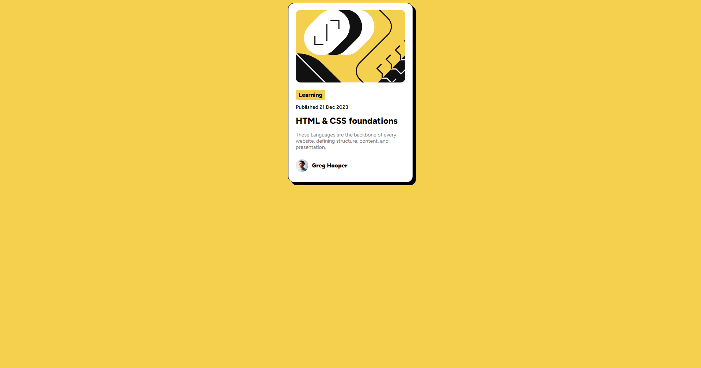

# Frontend Mentor - Blog preview card solution

This is a solution to the [Blog preview card challenge on Frontend Mentor](https://www.frontendmentor.io/challenges/blog-preview-card-ckPaj01IcS). Frontend Mentor challenges help you improve your coding skills by building realistic projects. 

## Table of contents

- [Overview](#overview)
  - [Screenshot](#screenshot)
  - [Links](#links)
- [My process](#my-process)
  - [Built with](#built-with)
  - [What I learned](#what-i-learned)
  - [Continued development](#continued-development)
- [Author](#author)

## Overview

### Screenshot

### Links

- Solution URL: [solution URL](https://github.com/jhossepmartinez/preview-card)
- Live Site URL: [live site URL](https://jhossepmartinez.github.io/preview-card/)

## My process

### Built with

- Semantic HTML5 markup
- CSS custom properties
- Flexbox
- Mobile-first workflow

### What I learned

In this challenge i learned how to properly use live server package, some css and proper html structure.

### Continued development

I would love to keep learning about flex box to get a proper knowledge on managing content space and position, after that i plan on using tailwind, this is, after i get a proper foundation on vanilla CSS.

## Author

- Website - [Jhossep Martinez](https://github.com/jhossepmartinez)

